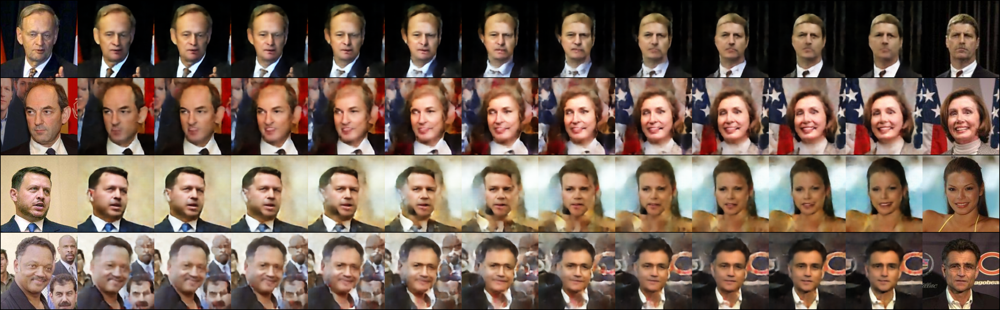

# VAE Image Reconstruction & Generation
Course project (optional task 1) of SJTU CS3612: Machine Learning, 2023 spring.

### Task objective
- You should design and train a VAE on LFW dataset.
- You should use Linear interpolation to generate images with specific properties.
For example, given two output features of the encoder, i.e., $z_1$ and $z_2$ , the decoder takes $z_1$ as the input to generate a face image of a woman, and takes $z_2$ as the input to generate a face image of a man. You can use Linear interpolation to obtain a new feature $z = \alpha z_1 + (1 − \alpha)z_2 ,\alpha \in (0,1)$. Then, the decoder takes 𝑧 as the input to generate a new face image. You are required to do experiments with different values of 𝛼, e.g., 𝛼=0.2, 0.4, 0.6, 0.8, so as to obtain a set of face images.
• You can conduct experiments on any two categories (e.g., male and female, old and young)

### Designed network architecture


### Image reconstruction
left: original input / right: reconstructed output

Pairwise comparison:


### Face fusion
Random integration:

Male and female:

Old and young:


### Run codes
Note that you may need to manually download the LFW dataset first via [this link](https://drive.google.com/uc?id=1LhptLOva-ZAQaS1T2UDFfyPVy0T538G9&export=download), and place the unzipped folder under directory `dataset`.
- Train model with tuned parameters
```
python train.py
```
- Test image reconstruction and generation
```
python main.py
```
- Generate the Old-Young fusion example
```
python example.py
```

For further information, refer to Section 2 of the project report [here](report/Report_for_Machine_Learning_Project.pdf).

